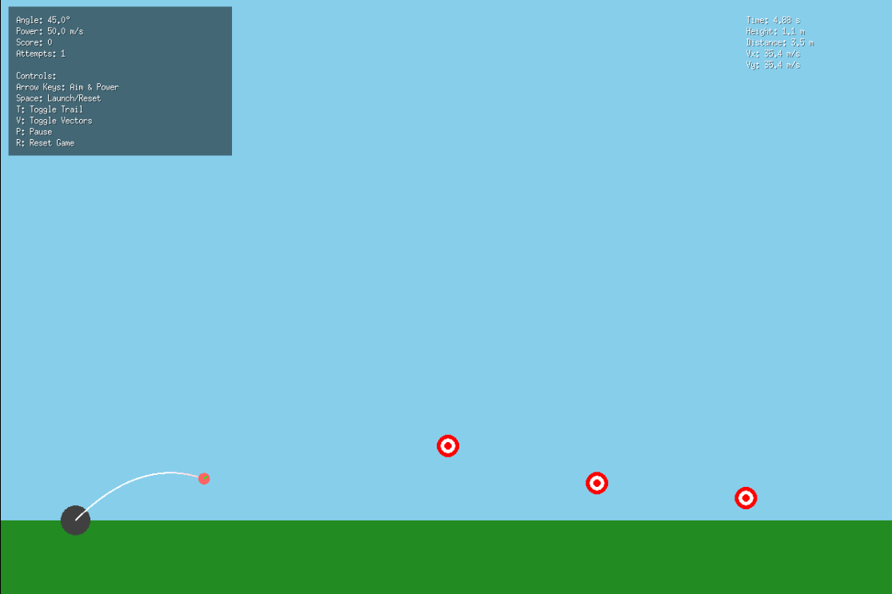

# Physics Simulator - Projectile Motion Education Game

A complete physics education game built with Ebiten that teaches projectile motion through interactive experimentation. Students can launch projectiles, adjust parameters, and observe real-time physics calculations.



## What This Game Teaches

This simulator demonstrates fundamental physics concepts:
- **Projectile Motion**: How objects move through the air under gravity
- **Velocity Components**: How speed has both horizontal (X) and vertical (Y) parts
- **Trajectory Prediction**: Mathematical calculation of where projectiles will land
- **Physics Equations**: Real-world formulas like `y = vt - ½gt²`

## Getting Started (Complete Beginner Guide)

### What You'll Need

1. **Go Programming Language** (it's free!)
   - Go to https://golang.org/dl/
   - Download and install Go for your operating system
   - This is what runs our game code

2. **A Code Editor** (optional but helpful)
   - VS Code (free): https://code.visualstudio.com/
   - Or any text editor works fine

3. **Terminal/Command Prompt**
   - Windows: Press `Win + R`, type `cmd`, press Enter
   - Mac: Press `Cmd + Space`, type `terminal`, press Enter
   - Linux: Press `Ctrl + Alt + T`

### Installation Steps

1. **Create a new folder** for your game:
   ```bash
   mkdir projectile_sim
   cd projectile_sim
   ```

2. **Initialize a Go project**:
   ```bash
   go mod init projectile_sim
   ```
   This creates a `go.mod` file that tracks your project's dependencies.

3. **Install Ebiten** (the game engine):
   ```bash
   go get github.com/hajimehoshi/ebiten/v2
   ```
   This downloads the Ebiten library that handles graphics, input, and game loops.

4. **Create the main game file**:
   - Copy the game code into a file named `main.go`
   - Save it in your `projectile_sim` folder

5. **Run the game**:
   ```bash
   go run main.go
   ```

## Game Controls

| Key | Action |
|-----|--------|
| ↑ ↓ | Adjust launch angle (0° to 90°) |
| ← → | Adjust launch power (5 to 50 m/s) |
| Space | Launch projectile / Reset for next shot |
| T | Toggle trail visibility on/off |
| V | Toggle velocity vectors and trajectory prediction |
| P | Pause/unpause the simulation |
| R | Reset entire game (new targets, reset score) |

## Understanding the Game Elements

### The Cannon
- **Gray circle** at the bottom-left
- **Yellow line** shows aim direction and power
- Longer yellow line = more power

### The Projectile (Ball)
- **Red circle** that follows physics
- Leaves a **fading trail** showing its path
- **Green arrow** shows current velocity (speed and direction)

### Targets
- **Red and white bullseye circles**
- Hit them to score points
- New targets appear when you reset the game

### Physics Display
Shows real-time calculations:
- **Time**: How long the projectile has been flying
- **Height**: How high above ground (in meters)
- **Distance**: How far horizontally it traveled
- **Vx/Vy**: Horizontal and vertical velocity components

## How the Physics Works

### Core Concepts Explained Simply

1. **Projectile Motion**: When you throw a ball, it follows a curved path (parabola) because:
   - Gravity pulls it down constantly
   - It maintains its horizontal speed
   - These combine to create the arc

2. **Velocity Components**:
   - **Horizontal (Vx)**: Speed sideways (stays constant, ignoring air resistance)
   - **Vertical (Vy)**: Speed up/down (changes due to gravity)

3. **The Math** (what the computer calculates):
   ```
   Horizontal position: x = initial_speed_x × time
   Vertical position: y = initial_speed_y × time - ½ × gravity × time²
   ```

### Educational Experiments to Try

1. **Find the Optimal Angle**:
   - Try different angles with the same power
   - Notice that 45° often gives the longest range
   - Experiment with why this happens

2. **Power vs Range**:
   - Use the same angle but different power levels
   - See how doubling power affects distance

3. **Trajectory Prediction**:
   - Turn on vectors (press V)
   - Watch the yellow dots show where the ball will go
   - Compare prediction with actual path

4. **Velocity Analysis**:
   - Watch how Vx stays constant
   - See how Vy starts positive, becomes zero at peak, then negative

## Code Structure (For Learning Programming)

### Main Components

1. **Game Loop**: The heart of any game
   ```go
   func (g *Game) Update() error // Handles input and physics
   func (g *Game) Draw(screen *ebiten.Image) // Draws everything
   ```

2. **Physics Engine**: 
   ```go
   func (b *Ball) Update(dt float64) // Calculates ball position
   ```

3. **Data Structures**:
   ```go
   type Vector2 struct { X, Y float64 } // Represents positions and velocities
   type Ball struct { ... }             // Stores ball state
   type Game struct { ... }             // Stores entire game state
   ```

### Key Programming Concepts Demonstrated

- **Structs**: Custom data types (Vector2, Ball, Game)
- **Methods**: Functions that belong to structs
- **Game Loop**: Update → Draw → Repeat (60 times per second)
- **Event Handling**: Responding to keyboard input
- **Mathematical Modeling**: Converting physics equations to code

## Customization Ideas

### Easy Modifications

1. **Change Physics Constants**:
   ```go
   var gravity = 9.8  // Try Moon gravity: 1.6
   var scale = 50.0   // Zoom in/out
   ```

2. **Add More Targets**:
   ```go
   game.targets = []Vector2{
       {800, screenHeight - groundHeight - 50},
       // Add more coordinates here
   }
   ```

3. **Ball Appearance**:
   ```go
   Color: color.RGBA{255, 100, 100, 255}, // Red, Green, Blue, Alpha
   ```

### Advanced Modifications

1. **Air Resistance**: Add drag force
2. **Multiple Balls**: Launch several at once
3. **Moving Targets**: Animated targets
4. **Wind Effects**: Horizontal forces
5. **Different Planets**: Various gravity settings

## Troubleshooting

### Common Issues

1. **"go: command not found"**
   - Go isn't installed or not in PATH
   - Reinstall Go and restart terminal

2. **"package not found"**
   - Run `go mod tidy` to fix dependencies
   - Make sure you're in the right folder

3. **Game window doesn't appear**
   - Check if you have graphics drivers installed
   - Try running with `go run -tags=debug main.go`

4. **Game runs slowly**
   - Close other programs
   - Your computer might be older - that's okay!

## Learning Path

### If You're New to Programming

1. **Start Here**: Run the game and experiment with controls
2. **Understand the Physics**: Read the equations and try different values
3. **Explore the Code**: Look at the structs and functions
4. **Make Small Changes**: Modify colors, positions, or physics constants
5. **Add Features**: Try implementing your own ideas

### Next Steps

- Learn more Go: https://tour.golang.org/
- Explore game development: https://ebiten.org/
- Study physics simulations: Try adding new forces or objects
- Build your own games: Start with simple concepts and grow

## Educational Standards Alignment

This simulator supports learning objectives in:
- **Physics**: Kinematics, forces, energy
- **Mathematics**: Trigonometry, quadratic equations, vectors
- **Computer Science**: Programming concepts, algorithms, data structures
- **Engineering**: Problem-solving, modeling, optimization

## Contributing

Want to improve this educational tool? Here's how:

1. Fork the repository
2. Make your changes
3. Test thoroughly
4. Submit a pull request

Ideas for contributions:
- Better graphics
- More physics scenarios
- Additional educational content
- Accessibility improvements
- Performance optimizations

## License

This project is open source and available under the MIT License. Feel free to use it for educational purposes, modify it, or build upon it.

## Credits

- **Physics Engine**: Custom implementation based on classical mechanics
- **Graphics**: Ebiten game engine (https://ebiten.org/)
- **Educational Design**: Focused on hands-on learning and experimentation

---
